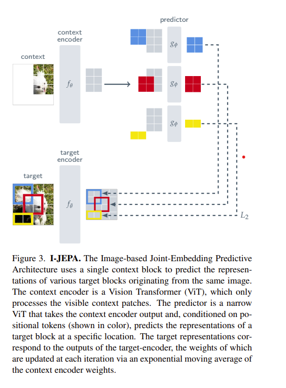

# I-JEPA
Implementation of I-JEPA from ([Self-Supervised Learning from Images with a Joint-Embedding Predictive Architecture](https://arxiv.org/abs/2301.08243))

Uses @lucidrains x-transfromers (https://github.com/lucidrains/x-transformers)

Basic Schematic of Architecture:



In order to run, just run: `python train.py` on your command line

TODO:
- linear probing setup
- pool representations of last k layers


Citation:

```
@article{assran2023self,
  title={Self-Supervised Learning from Images with a Joint-Embedding Predictive Architecture},
  author={Assran, Mahmoud and Duval, Quentin and Misra, Ishan and Bojanowski, Piotr and Vincent, Pascal and Rabbat, Michael and LeCun, Yann and Ballas, Nicolas},
  journal={arXiv preprint arXiv:2301.08243},
  year={2023}
}
```
